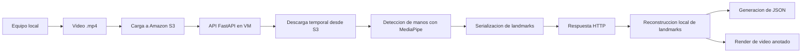

# HandsTrackingAWS

Proyecto orientado al seguimiento de manos sobre una arquitectura distribuida en AWS. El sistema recibe un video en formato `.mp4`, lo carga en Amazon S3 desde un entorno local, delega el procesamiento de visión por computadora a una máquina virtual que expone una API con FastAPI y devuelve como resultado un conjunto de landmarks por fotograma que hacen referencia a las manos detectadas en los frames analizados.

## Descripción General

La solución se encuentra dividida en dos contextos de ejecución:

- `Local`: prepara el video de entrada, realiza la carga al bucket de S3, invoca la API remota, reconstruye los landmarks recibidos y genera un video de salida con la visualización del seguimiento.
- `VM`: descarga temporalmente el video desde S3, procesa cada fotograma con MediaPipe Hands y expone los resultados mediante un endpoint HTTP.

Esta separación permite desacoplar la captura y visualización local del procesamiento intensivo ejecutado en la infraestructura remota.

## Instructivo de Configuración y Despliegue
Se encuentra dispuesto un documento guiado para la configuración y despliegue del proyecto en una infraestructura propia tanto local como en AWS dentro del archivo `configuration_tutorial.md`.

## Arquitectura



## Tecnologías Utilizadas

- Python 3.10
- MediaPipe `0.10.21`
- OpenCV
- FastAPI
- Uvicorn
- Boto3
- Requests
- Python Dotenv
- FFmpeg
- Amazon S3
- Amazon EC2
- Conda, mediante archivos `mediapipe_env.yml`

## Estructura del Proyecto

```text
HandsTrackingAWS/
├── Local/
│   ├── configurations.py
│   ├── hand_tracker_visualization.py
│   ├── main.py
│   ├── mediapipe_env.yml
│   ├── video_uploader.py
│   ├── secret/
│   │   ├── .env.example
        ├── handtracking-ssh.pem
│   └── Video/
│       └── hand_landmarks.json
        └── example.mp4
        └── example_with_hands.mp4
└── VM/
    ├── configurations.py
    ├── hand_tracker.py
    ├── hand_tracker_API.py
    ├── mediapipe_env.yml
    └── video_getter.py
```

## Componentes Principales

### Módulo local

- `Local/main.py`: orquesta el flujo completo del lado cliente.
- `Local/video_uploader.py`: valida y sube el video al bucket de S3.
- `Local/hand_tracker_visualization.py`: dibuja los landmarks en el video original y genera el video procesado.
- `Local/configurations.py`: concentra rutas locales, bucket, objeto S3, duración de análisis y ubicación de resultados.

### Módulo remoto en VM

- `VM/hand_tracker_API.py`: define la aplicación FastAPI y expone el endpoint `/get_hand_landmarks`.
- `VM/hand_tracker.py`: ejecuta la detección de manos sobre cada fotograma.
- `VM/video_getter.py`: descarga el video desde S3 a un archivo temporal y entrega los fotogramas al procesador.
- `VM/configurations.py`: centraliza la configuración base del entorno remoto.

## Requisitos Previos

Antes de ejecutar el proyecto, se requiere lo descrito a continuación. Cada uno de los posteriores elementos pueden ser obtenidos y configurados al seguir las instrucciones detalladas propuestas en el documento `configuration_tutorial.md`

- Una cuenta de AWS con acceso a S3.
- Una instancia EC2 o un entorno equivalente capaz de exponer la API remota.
- Credenciales de AWS configuradas en el entorno local y en la VM.
- Conda instalado para crear los entornos definidos por los archivos YAML.
- FFmpeg disponible en el entorno local para la generación del video final.
- Un archivo de video `.mp4` de entrada.

## Parámetros de Configuración

Los principales parámetros operativos se encuentran en `Local/configurations.py`:

- `SOURCE_VIDEO_FILE_PATH`: ruta del video de entrada.
- `S3_BUCKET_NAME`: nombre del bucket utilizado para el intercambio de archivos.
- `VIDEO_OBJECT_KEY`: clave del objeto dentro de S3.
- `ANALYSIS_DURATION_MS`: duración máxima a procesar, en milisegundos.
- `OUTPUT_VIDEO_PATH`: ruta del video resultante.
- `OUTPUT_HAND_LANDMARKS_JSON_PATH`: ruta del JSON con landmarks serializados.

Se recomienda mantener consistencia entre el bucket y la clave configurados en los módulos local y remoto.

## Ejecución del Proyecto.
Se encuentra dispuesto un documento guiado para la configuración y despliegue del proyecto en una infraestructura propia tanto local como en AWS dentro del archivo `configuration_tutorial.md`.

### 1. Iniciar la API en la VM

Desde la raíz del proyecto en la máquina remota:

```bash
uvicorn VM.hand_tracker_API:app --host 0.0.0.0 --port 8000
```

Si se requiere acceso externo, el grupo de seguridad de la instancia debe permitir tráfico de entrada al puerto `8000`.

### 2. Ejecutar el flujo local

Desde la raíz del repositorio en el equipo local:

```bash
python -m Local.main
```

## Flujo de Procesamiento

1. El módulo local valida que el archivo exista y que su extensión sea `.mp4`.
2. El video se carga al bucket de Amazon S3.
3. El cliente local realiza una petición `GET` al endpoint `/get_hand_landmarks`.
4. La API remota descarga el video desde S3 a un archivo temporal.
5. MediaPipe Hands procesa los fotogramas hasta alcanzar la duración configurada.
6. La API serializa los landmarks detectados y los devuelve como JSON.
7. El cliente local reconstruye las estructuras de landmarks de MediaPipe.
8. Se genera un archivo JSON con los resultados y un video anotado con las manos detectadas.

## Endpoint Expuesto

La API remota expone el siguiente endpoint:

```http
GET /get_hand_landmarks
```

Parámetros necesarios:

- `duration_ms`: duración máxima a procesar.
- `bucket_name`: nombre del bucket de S3.
- `object_key`: clave del objeto de video dentro del bucket.

Ejemplo de Respuesta:

```json
{
  "hand_landmarks": {
    "1933": [
      [
        {"x": 0.48, "y": 1.01, "z": 0.00}
      ]
    ]
  }
}
```

Cada clave del objeto `hand_landmarks` representa una marca temporal en milisegundos. Para cada instante, se devuelve una lista de manos detectadas y, para cada mano, la colección de puntos clave generados por MediaPipe.

## Artefactos Generados

Durante la ejecución se producen los siguientes archivos:

- `Local/Video/hand_landmarks.json`: landmarks serializados recibidos desde la API.
- `Local/Video/example_with_hands.mp4`: video final con la visualización del seguimiento.

## Consideraciones Operativas

- El archivo de entrada debe estar en formato `.mp4`.
- El procesamiento local depende de `ffmpeg` para convertir el archivo temporal `out.mp4` al video final.
- El entorno local requiere conectividad hacia la IP pública o DNS de la VM.
- La VM también requiere permisos y conectividad suficientes para descargar el objeto desde S3.
- La duración de análisis se limita mediante `ANALYSIS_DURATION_MS`, por lo que no necesariamente se procesa el video completo.

## Posibles Errores Frecuentes

- Si el sistema indica que no existen credenciales de AWS, se deben configurar correctamente en el entorno que falló.
- Si la petición HTTP no responde, debe verificarse que la API esté activa y que el puerto `8000` esté expuesto.
- Si no se genera el video final, debe revisarse la disponibilidad de `ffmpeg` en el entorno local.
- Si el archivo no se carga a S3, debe comprobarse que el bucket exista y que el usuario o rol tenga permisos adecuados.